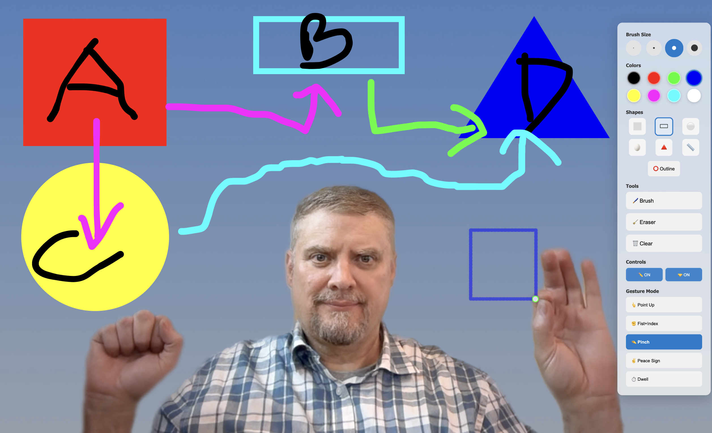

# AirCanvas 🎨✋

**A web-based drawing application for use in live video streams, controlled entirely by hand gestures and finger tracking.**



For video presentations, online meetings, and interactive demonstrations where you want to draw and annotate while being visible on camera.

## ✨ Features

### 🤲 Advanced Hand Tracking
- **Real-time finger detection** using MediaPipe AI
- **Multiple gesture modes** for different drawing preferences
- **Two-hand control** for precision drawing control
- **Smart hand recognition** with automatic dominant hand detection

### 🎨 Professional Drawing Tools
- **Brush sizes**: 4 different sizes for various drawing needs
- **Color palette**: 8 essential colors for clear annotations
- **Shape tools**: Square, rectangle, circle, ellipse, triangle, and line
- **Fill/Outline modes**: Choose between filled shapes or outlines
- **Eraser tool**: Remove unwanted marks
- **Clear canvas**: Clear the canvas and start fresh

### 🎯 Gesture Control Modes
Choose the gesture that feels most natural to you:

- **👆 Point Up**: Point your index finger upward to draw
- **✊ Fist+Index**: Make a fist and extend only your index finger
- **🤏 Pinch**: Bring thumb and index finger together
- **✌️ Peace Sign**: Extend index and middle fingers
- **⏱️ Dwell**: Point and hold still for 0.5 seconds to start drawing

### 🎛️ Smart Controls
- **Two-Hand Control**: Use your non-drawing hand as a "safety" - only draw when making a fist (on by default)
- **Drawing Toggle**: Master on/off switch for all drawing
- **Dwell-based UI**: Point and hold to select tools (no accidental clicks)
- **Visual Feedback**: Color-coded finger indicator (green = draw enabled, red = disabled)

## 🚀 Quick Start

### Prerequisites
- Modern web browser (Chrome, Firefox, Safari, Edge)
- Webcam access
- Good lighting for optimal hand tracking

### Run Air Canvas

Air Canvas is hosted via GitHub Pages and has no other dependencies beyond a compatible web browser and web camera. To run Air Canvas, simply vist the following link:  [AirCanvas](https://robert-mcdermott.github.io/aircanvas/)

### Installation (not required; just use the link above)

1. **Clone the repository**
   ```bash
   git clone https://github.com/robert-mcdermott/aircanvas.git
   cd aircanvas
   ```

2. **Open in browser**
   ```bash
   # Simply open index.html in your browser
   # Or use a local server:
   python -m http.server 8000
   # Then visit: http://localhost:8000
   ```

3. **Allow camera access** when prompted

4. **Start drawing!** 🎉

## 📖 How to Use

### Basic Setup
1. **Position yourself** 2-3 feet from your camera
2. **Ensure good lighting** for best hand tracking
3. **Allow camera access** when prompted
4. **Expand the toolbox** by pointing at the 🎨 icon

### Choosing Your Gesture
1. **Open the toolbox** and navigate to "Gesture Mode"
2. **Try different modes** to find what feels natural:
   - Start with **Point Up** or **Fist+Index** (most stable)
   - **Pinch** for precise control
   - **Dwell** for continuous drawing

### Two-Hand Control (Recommended)
1. **Keep "Two-Hand Control" ON** (default)
2. **Make a fist** with your non-drawing hand to enable drawing
3. **Open your control hand** to stop drawing
4. **Use any gesture** with your drawing hand

### Drawing Tips
- **Green indicator** = ready to draw
- **Red indicator** = drawing disabled
- **Point and hold** on toolbox items for 1 second to select
- **Blue glow** shows when you're near a control

## 🎯 Use Cases

### 📹 Video Presentations
- **Explain concepts** while staying visible on camera
- **Annotate slides** during live presentations
- **Draw diagrams** in real-time during meetings

### 🖥️ Screen Sharing
- **OBS integration** for streaming and recording
- **Teams/Zoom presentations** with live drawing
- **Interactive demonstrations** and tutorials

### 🎓 Education
- **Virtual teaching** with gesture-based annotation
- **Interactive lessons** with real-time drawing
- **Student engagement** through visual explanations

## 🛠️ Technical Details

### Built With
- **Vanilla JavaScript** - No frameworks, fast and simple
- **MediaPipe Hands** - Google's AI hand tracking
- **HTML5 Canvas** - High-performance drawing
- **CSS3** - Modern, responsive design

### Browser Support
- ✅ Chrome 88+
- ✅ Firefox 90+
- ✅ Safari 14+
- ✅ Edge 88+

### Performance
- **Lightweight**: ~100KB total size
- **Fast**: 60fps hand tracking
- **Efficient**: Low CPU usage
- **Responsive**: Real-time gesture recognition

## 🎨 Customization

### Gesture Sensitivity
Edit `app.js` to adjust gesture detection thresholds:
```javascript
// Pinch sensitivity (smaller = more sensitive)
return distance < 0.08;

// Dwell time (milliseconds)
this.dwellDuration = 1000;
```

### Colors and Sizes
Modify the toolbox in `index.html`:
```html
<!-- Add new colors -->
<div class="color" data-color="#your-color" style="background: #your-color;"></div>

<!-- Add new brush sizes -->
<div class="brush-size" data-size="30"></div>
```

### UI Transparency
Adjust in `styles.css`:
```css
.toolbox-content {
    background: rgba(255, 255, 255, 0.7); /* 0.7 = 70% transparent */
}
```

### Development Setup
```bash
# Clone and enter directory
git clone https://github.com/robert-mcdermott/aircanvas.git
cd aircanvas

# No build process needed - just edit and reload!
# Use a local server for testing:
python -m http.server 8000
```


